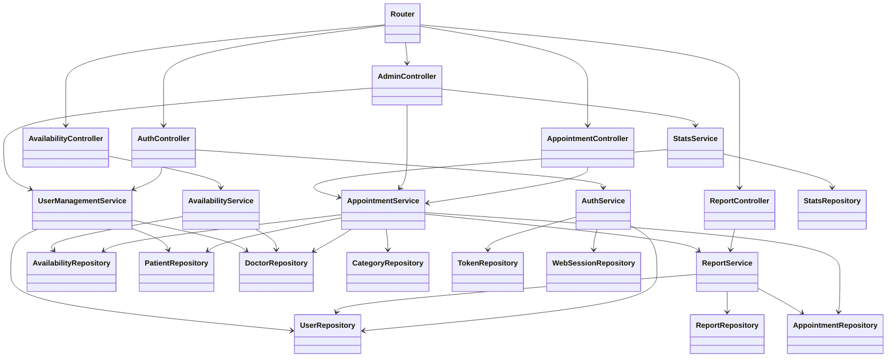

# UML Class Diagram - Synthetic View (Mermaid)

```mermaid
classDiagram
    class Router

    class AuthController
    class AppointmentController
    class ReportController
    class AvailabilityController
    class AdminController

    class AuthService
    class AppointmentService
    class ReportService
    class AvailabilityService
    class UserManagementService
    class StatsService

    class UserRepository
    class AppointmentRepository
    class AvailabilityRepository
    class ReportRepository
    class PatientRepository
    class DoctorRepository
    class CategoryRepository
    class TokenRepository
    class WebSessionRepository
    class StatsRepository

    Router --> AuthController
    Router --> AppointmentController
    Router --> ReportController
    Router --> AvailabilityController
    Router --> AdminController

    AuthController --> AuthService
    AuthController --> UserManagementService

    AppointmentController --> AppointmentService
    ReportController --> ReportService
    AvailabilityController --> AvailabilityService

    AdminController --> UserManagementService
    AdminController --> AppointmentService
    AdminController --> StatsService

    AuthService --> UserRepository
    AuthService --> TokenRepository
    AuthService --> WebSessionRepository

    AppointmentService --> AppointmentRepository
    AppointmentService --> AvailabilityRepository
    AppointmentService --> PatientRepository
    AppointmentService --> DoctorRepository
    AppointmentService --> CategoryRepository
    AppointmentService --> ReportService

    ReportService --> ReportRepository
    ReportService --> AppointmentRepository
    ReportService --> UserRepository

    AvailabilityService --> AvailabilityRepository
    AvailabilityService --> DoctorRepository

    UserManagementService --> UserRepository
    UserManagementService --> PatientRepository
    UserManagementService --> DoctorRepository

    StatsService --> StatsRepository
    StatsService --> AppointmentService
```

Vista sintetica pensata per stampa/lettura rapida.
Per il dettaglio completo: `docs/class-diagram.md`.
