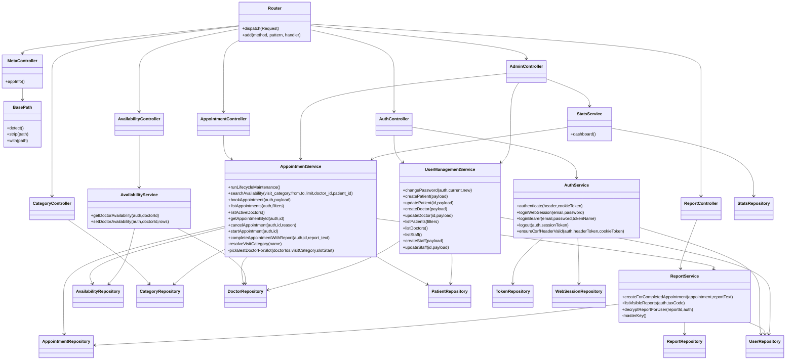

# UML Class Diagram (Mermaid)

```mermaid
classDiagram
    class Router {
      +dispatch(Request)
      +add(method, pattern, handler)
    }

    class BasePath {
      +detect()
      +strip(path)
      +with(path)
    }

    class AuthController
    class AppointmentController
    class ReportController
    class AvailabilityController
    class AdminController
    class CategoryController
    class MetaController {
      +appInfo()
    }

    class AuthService {
      +authenticate(header,cookieToken)
      +loginWebSession(email,password)
      +loginBearer(email,password,tokenName)
      +logout(auth,sessionToken)
      +ensureCsrfHeaderValid(auth,headerToken,cookieToken)
    }

    class AppointmentService {
      +runLifecycleMaintenance()
      +searchAvailability(visit_category,from,to,limit,doctor_id,patient_id)
      +bookAppointment(auth,payload)
      +listAppointments(auth,filters)
      +listActiveDoctors()
      +getAppointmentById(auth,id)
      +cancelAppointment(auth,id,reason)
      +startAppointment(auth,id)
      +completeAppointmentWithReport(auth,id,report_text)
      -resolveVisitCategory(name)
      -pickBestDoctorForSlot(doctorIds,visitCategory,slotStart)
    }

    class AvailabilityService {
      +getDoctorAvailability(auth,doctorId)
      +setDoctorAvailability(auth,doctorId,rows)
    }

    class ReportService {
      +createForCompletedAppointment(appointment,reportText)
      +listVisibleReports(auth,taxCode)
      +decryptReportForUser(reportId,auth)
      -masterKey()
    }

    class UserManagementService {
      +changePassword(auth,current,new)
      +createPatient(payload)
      +updatePatient(id,payload)
      +createDoctor(payload)
      +updateDoctor(id,payload)
      +listPatients(filters)
      +listDoctors()
      +listStaff()
      +createStaff(payload)
      +updateStaff(id,payload)
    }

    class StatsService {
      +dashboard()
    }

    class AppointmentRepository
    class AvailabilityRepository
    class CategoryRepository
    class DoctorRepository
    class PatientRepository
    class ReportRepository
    class UserRepository
    class TokenRepository
    class WebSessionRepository
    class StatsRepository

    Router --> AuthController
    Router --> AppointmentController
    Router --> ReportController
    Router --> AvailabilityController
    Router --> AdminController
    Router --> CategoryController
    Router --> MetaController

    AuthController --> AuthService
    AuthController --> UserManagementService
    AppointmentController --> AppointmentService
    ReportController --> ReportService
    AvailabilityController --> AvailabilityService
    AdminController --> UserManagementService
    AdminController --> AppointmentService
    AdminController --> StatsService
    CategoryController --> CategoryRepository
    MetaController --> BasePath

    AuthService --> UserRepository
    AuthService --> TokenRepository
    AuthService --> WebSessionRepository

    AppointmentService --> AppointmentRepository
    AppointmentService --> AvailabilityRepository
    AppointmentService --> DoctorRepository
    AppointmentService --> PatientRepository
    AppointmentService --> CategoryRepository
    AppointmentService --> ReportService

    ReportService --> ReportRepository
    ReportService --> AppointmentRepository
    ReportService --> UserRepository

    AvailabilityService --> AvailabilityRepository
    AvailabilityService --> DoctorRepository

    UserManagementService --> UserRepository
    UserManagementService --> PatientRepository
    UserManagementService --> DoctorRepository

    StatsService --> StatsRepository
    StatsService --> AppointmentService
```
