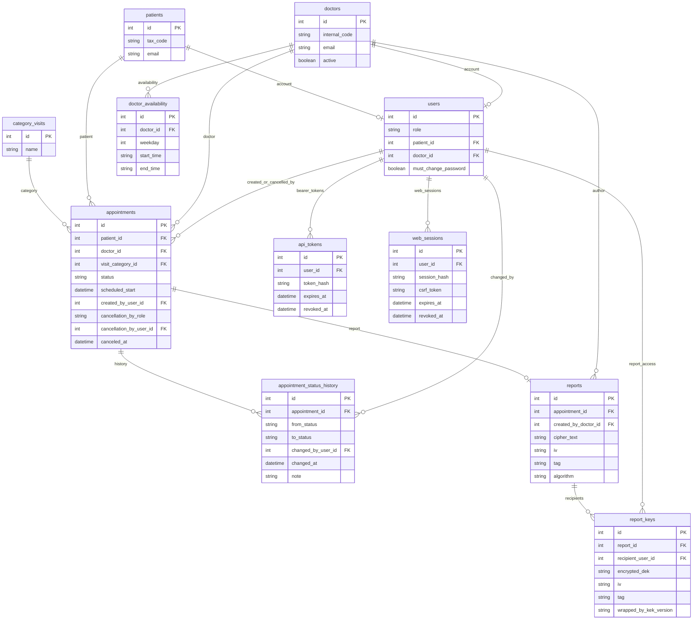

# ER Diagram - Synthetic View (Mermaid)

```mermaid
erDiagram
    users {
      int id PK
      string role
      int patient_id FK
      int doctor_id FK
      boolean must_change_password
    }

    patients {
      int id PK
      string tax_code
      string email
    }

    doctors {
      int id PK
      string internal_code
      string email
      boolean active
    }

    category_visits {
      int id PK
      string name
    }

    doctor_availability {
      int id PK
      int doctor_id FK
      int weekday
      string start_time
      string end_time
    }

    appointments {
      int id PK
      int patient_id FK
      int doctor_id FK
      int visit_category_id FK
      string status
      datetime scheduled_start
      int created_by_user_id FK
      string cancellation_by_role
      int cancellation_by_user_id FK
      datetime canceled_at
    }

    appointment_status_history {
      int id PK
      int appointment_id FK
      string from_status
      string to_status
      int changed_by_user_id FK
      datetime changed_at
      string note
    }

    reports {
      int id PK
      int appointment_id FK
      int created_by_doctor_id FK
      string cipher_text
      string iv
      string tag
      string algorithm
    }

    report_keys {
      int id PK
      int report_id FK
      int recipient_user_id FK
      string encrypted_dek
      string iv
      string tag
      string wrapped_by_kek_version
    }

    api_tokens {
      int id PK
      int user_id FK
      string token_hash
      datetime expires_at
      datetime revoked_at
    }

    web_sessions {
      int id PK
      int user_id FK
      string session_hash
      string csrf_token
      datetime expires_at
      datetime revoked_at
    }

    patients ||--o| users : account
    doctors ||--o| users : account

    doctors ||--o{ doctor_availability : availability

    category_visits ||--o{ appointments : category
    patients ||--o{ appointments : patient
    doctors ||--o{ appointments : doctor
    users ||--o{ appointments : created_or_cancelled_by

    appointments ||--o{ appointment_status_history : history
    users ||--o{ appointment_status_history : changed_by

    appointments ||--o| reports : report
    doctors ||--o{ reports : author
    reports ||--o{ report_keys : recipients
    users ||--o{ report_keys : report_access

    users ||--o{ api_tokens : bearer_tokens
    users ||--o{ web_sessions : web_sessions
```

Questa vista e pensata per stampa/lettura rapida.
Per il dettaglio completo: `docs/er-diagram.md`.
