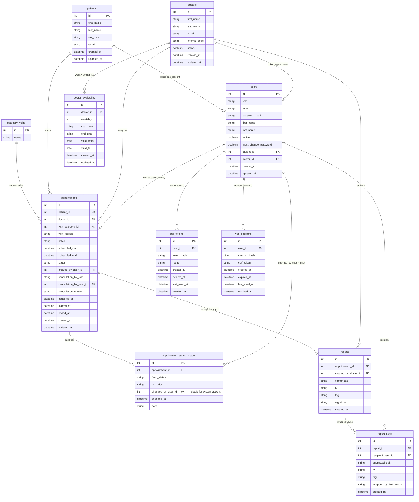

# ER Diagram (Mermaid)

```mermaid
erDiagram
    users {
      int id PK
      string role
      string email
      string password_hash
      string first_name
      string last_name
      boolean active
      boolean must_change_password
      int patient_id FK
      int doctor_id FK
      datetime created_at
      datetime updated_at
    }

    patients {
      int id PK
      string first_name
      string last_name
      string tax_code
      string email
      datetime created_at
      datetime updated_at
    }

    doctors {
      int id PK
      string first_name
      string last_name
      string email
      string internal_code
      boolean active
      datetime created_at
      datetime updated_at
    }

    category_visits {
      int id PK
      string name
    }

    doctor_availability {
      int id PK
      int doctor_id FK
      int weekday
      string start_time
      string end_time
      date valid_from
      date valid_to
      datetime created_at
      datetime updated_at
    }

    appointments {
      int id PK
      int patient_id FK
      int doctor_id FK
      int visit_category_id FK
      string visit_reason
      string notes
      datetime scheduled_start
      datetime scheduled_end
      string status
      int created_by_user_id FK
      string cancellation_by_role
      int cancellation_by_user_id FK
      string cancellation_reason
      datetime canceled_at
      datetime started_at
      datetime ended_at
      datetime created_at
      datetime updated_at
    }

    appointment_status_history {
      int id PK
      int appointment_id FK
      string from_status
      string to_status
      int changed_by_user_id FK "nullable for system actions"
      datetime changed_at
      string note
    }

    reports {
      int id PK
      int appointment_id FK
      int created_by_doctor_id FK
      string cipher_text
      string iv
      string tag
      string algorithm
      datetime created_at
    }

    report_keys {
      int id PK
      int report_id FK
      int recipient_user_id FK
      string encrypted_dek
      string iv
      string tag
      string wrapped_by_kek_version
      datetime created_at
    }

    api_tokens {
      int id PK
      int user_id FK
      string token_hash
      string name
      datetime created_at
      datetime expires_at
      datetime last_used_at
      datetime revoked_at
    }

    web_sessions {
      int id PK
      int user_id FK
      string session_hash
      string csrf_token
      datetime created_at
      datetime expires_at
      datetime last_used_at
      datetime revoked_at
    }

    patients ||--o| users : "linked app account"
    doctors ||--o| users : "linked app account"
    doctors ||--o{ doctor_availability : "weekly availability"
    category_visits ||--o{ appointments : "catalog entry"
    patients ||--o{ appointments : "books"
    doctors ||--o{ appointments : "assigned"
    users ||--o{ appointments : "created/cancelled by"
    appointments ||--o{ appointment_status_history : "audit trail"
    users ||--o{ appointment_status_history : "changed_by when human"
    appointments ||--o| reports : "completed report"
    doctors ||--o{ reports : "authors"
    reports ||--o{ report_keys : "wrapped DEKs"
    users ||--o{ report_keys : "recipient"
    users ||--o{ api_tokens : "bearer tokens"
    users ||--o{ web_sessions : "browser sessions"
```
